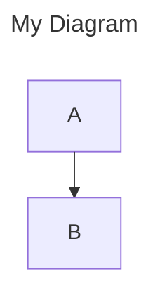
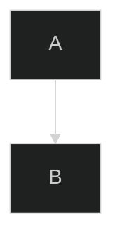

# Mermaid Linter

A fast, reliable Rust-based syntax linter for [Mermaid](https://mermaid.js.org/) diagrams. Parse Mermaid text without rendering, detect diagram types, validate syntax, and get detailed diagnostics.

[](https://www.rust-lang.org/)
[](LICENSE)
[](#testing)

## Features

- **Fast Parsing** - Native Rust implementation for optimal performance
- **No Rendering Required** - Validate diagrams without a browser or rendering engine
- **Comprehensive Diagnostics** - Detailed error messages with line/column information
- **AST Output** - Get structured Abstract Syntax Tree for valid diagrams
- **Multiple Diagram Types** - Support for 9 diagram types including flowcharts, sequence, class, state, ER, Gantt, and more
- **Frontmatter Support** - Parse YAML frontmatter for titles and configuration
- **Directive Support** - Handle `%%{init: ...}%%` and `%%{wrap}%%` directives
- **CLI & Library** - Use as a command-line tool or integrate as a Rust library

## Installation

### From Source

```bash
git clone https://github.com/0xd219b/mermaid-linter.git
cd mermaid-linter
cargo build --release
```

The binary will be available at `target/release/mermaid-lint`.

### As a Dependency

Add to your `Cargo.toml`:

```toml
[dependencies]
mermaid-linter = { git = "https://github.com/0xd219b/mermaid-linter.git" }
```

## Quick Start

### Command Line

```bash
# Lint a file
mermaid-lint diagram.mmd

# Lint multiple files
mermaid-lint diagram1.mmd diagram2.mmd

# Read from stdin
echo "graph TD; A-->B" | mermaid-lint

# Output as JSON
mermaid-lint --format json diagram.mmd

# Check only (exit code 0 = valid, 1 = invalid)
mermaid-lint --check diagram.mmd

# Show AST output
mermaid-lint --ast diagram.mmd
```

### As a Library

```rust
use mermaid_linter::{parse, validate, detect_type, DiagramType};

fn main() {
    let code = r#"
        graph TD
            A[Start] --> B{Decision}
            B -->|Yes| C[OK]
            B -->|No| D[Cancel]
    "#;

    // Full parse with AST
    let result = parse(code, None);

    if result.ok {
        println!("Diagram type: {:?}", result.diagram_type);
        println!("AST: {:?}", result.ast);
    } else {
        for diagnostic in &result.diagnostics {
            eprintln!("Error: {}", diagnostic.message);
        }
    }

    // Quick validation
    let is_valid = validate(code, None);
    println!("Valid: {}", is_valid);

    // Type detection only
    let diagram_type = detect_type(code);
    assert_eq!(diagram_type, Some(DiagramType::Flowchart));
}
```

## Supported Diagram Types

| Diagram Type | Status | Keyword |
|-------------|--------|---------|
| Flowchart | ✅ Full | `graph`, `flowchart` |
| Sequence | ✅ Full | `sequenceDiagram` |
| Class | ✅ Full | `classDiagram` |
| State | ✅ Full | `stateDiagram`, `stateDiagram-v2` |
| ER | ✅ Full | `erDiagram` |
| Gantt | ✅ Full | `gantt` |
| Pie | ✅ Full | `pie` |
| Journey | ✅ Full | `journey` |
| Git Graph | ✅ Full | `gitGraph` |
| Requirement | 🔄 Planned | `requirementDiagram` |
| Mindmap | 🔄 Planned | `mindmap` |
| Timeline | 🔄 Planned | `timeline` |
| C4 | 🔄 Planned | `C4Context` |
| And more... | 🔄 Planned | - |

## CLI Reference

```
mermaid-lint [OPTIONS] [FILES]...

Arguments:
  [FILES]...  Input file(s) to lint (reads from stdin if not provided)

Options:
  -f, --format <FORMAT>  Output format: text, json [default: text]
  -c, --check            Only validate, don't output AST
  -q, --quiet            Suppress output, only return exit code
      --ast              Show AST output
  -h, --help             Print help
  -V, --version          Print version

Subcommands:
  lint     Lint Mermaid diagram files
  detect   Detect diagram type
  check    Validate diagram syntax
  parse    Parse and output AST
```

### Examples

```bash
# Detect diagram type
mermaid-lint detect diagram.mmd
# Output: flowchart

# Parse and output AST as JSON
mermaid-lint parse --format json diagram.mmd

# Check multiple files
mermaid-lint check *.mmd
# Output:
# diagram1.mmd: OK
# diagram2.mmd: FAIL
# diagram3.mmd: OK
```

## API Reference

### Core Functions

#### `parse(code: &str, options: Option<ParseOptions>) -> ParseResult`

Parse a Mermaid diagram and return detailed results.

```rust
use mermaid_linter::{parse, ParseOptions, MermaidConfig};

// With default options
let result = parse("graph TD; A-->B", None);

// With custom configuration
let config = MermaidConfig {
    wrap: true,
    ..Default::default()
};
let options = ParseOptions::with_config(config);
let result = parse("graph TD; A-->B", Some(options));
```

#### `validate(code: &str, options: Option<ParseOptions>) -> bool`

Quick validation without AST generation.

```rust
use mermaid_linter::validate;

if validate("graph TD; A-->B", None) {
    println!("Valid diagram!");
}
```

#### `detect_type(code: &str) -> Option<DiagramType>`

Detect the diagram type without full parsing.

```rust
use mermaid_linter::{detect_type, DiagramType};

match detect_type("sequenceDiagram\nAlice->>Bob: Hello") {
    Some(DiagramType::Sequence) => println!("It's a sequence diagram!"),
    Some(other) => println!("Detected: {:?}", other),
    None => println!("Unknown diagram type"),
}
```

### Types

#### `ParseResult`

```rust
pub struct ParseResult {
    pub ok: bool,                           // Whether parsing succeeded
    pub diagram_type: Option<DiagramType>,  // Detected diagram type
    pub config: MermaidConfig,              // Merged configuration
    pub ast: Option<Ast>,                   // AST (if successful)
    pub diagnostics: Vec<Diagnostic>,       // Errors and warnings
    pub title: Option<String>,              // Title from frontmatter
}
```

#### `Diagnostic`

```rust
pub struct Diagnostic {
    pub code: DiagnosticCode,    // Error code
    pub message: String,         // Human-readable message
    pub severity: Severity,      // Error, Warning, or Info
    pub span: Span,              // Source location
}
```

#### `DiagramType`

```rust
pub enum DiagramType {
    Flowchart,      // graph keyword
    FlowchartV2,    // flowchart keyword
    FlowchartElk,   // flowchart-elk
    Sequence,       // sequenceDiagram
    Class,          // classDiagram (legacy)
    ClassDiagram,   // classDiagram-v2
    State,          // stateDiagram (legacy)
    StateDiagram,   // stateDiagram-v2
    // ... and more
}
```

## Frontmatter and Directives

### YAML Frontmatter



### Directives



## Preprocessing Pipeline

The linter processes diagrams through these stages:

1. **Normalize** - Convert CRLF to LF, standardize HTML attribute quotes
2. **Extract Frontmatter** - Parse YAML frontmatter for config and title
3. **Process Directives** - Extract and apply `%%{...}%%` directives
4. **Remove Comments** - Strip `%% comment` lines (preserve directives)
5. **Detect Type** - Identify diagram type from keywords
6. **Parse** - Diagram-specific parsing with AST generation
7. **Validate** - Semantic validation and diagnostic collection

## Testing

The project has comprehensive test coverage:

```bash
# Run all tests
cargo test

# Run with output
cargo test -- --nocapture

# Run specific test category
cargo test --test integration_tests
cargo test --test golden_tests
```

### Test Statistics

| Category | Tests | Status |
|----------|-------|--------|
| Unit Tests | 178 | ✅ Passing |
| Integration Tests | 178 | ✅ Passing (6 ignored) |
| Golden Tests | 17 | ✅ Passing |
| Doc Tests | 7 | ✅ Passing (2 ignored) |
| **Total** | **380+** | **✅ All Passing** |

## Project Structure

```
mermaid-linter/
├── src/
│   ├── lib.rs              # Public API
│   ├── ast/                # AST definitions
│   ├── config/             # Configuration types
│   ├── detector/           # Diagram type detection
│   ├── diagnostic/         # Error reporting
│   ├── diagrams/           # Diagram-specific parsers
│   │   ├── flowchart/
│   │   ├── sequence/
│   │   ├── class/
│   │   ├── state/
│   │   ├── er/
│   │   ├── gantt/
│   │   ├── journey/
│   │   ├── pie/
│   │   └── gitgraph/
│   ├── parser/             # Parser infrastructure
│   └── preprocess/         # Text preprocessing
├── tests/
│   ├── fixtures/           # Test diagram files
│   ├── golden/             # Golden test comparisons
│   └── integration/        # Integration tests
└── benches/                # Benchmarks (planned)
```

## Performance

The linter is designed for speed:

- Zero-copy parsing where possible
- Lazy regex compilation with `once_cell`
- Efficient tokenization with `logos`
- No runtime dependencies on JavaScript or browsers

## Compatibility

This linter aims to be compatible with [Mermaid.js](https://github.com/mermaid-js/mermaid). The detection order and preprocessing pipeline match the official implementation.

## Contributing

Contributions are welcome! Please feel free to submit a Pull Request.

### Development Setup

```bash
# Clone the repository
git clone https://github.com/0xd219b/mermaid-linter.git
cd mermaid-linter

# Build
cargo build

# Run tests
cargo test

# Run linter on itself
cargo run -- tests/fixtures/**/*.mmd
```

### Adding a New Diagram Type

1. Create a new module in `src/diagrams/`
2. Implement the lexer using `logos`
3. Implement the parser
4. Add detection pattern in `src/detector/detectors.rs`
5. Register in `src/parser/mod.rs`
6. Add tests in `tests/integration/` and `tests/fixtures/`

## Roadmap

- [x] Phase 1-2: Core infrastructure and basic diagrams (Flowchart, Sequence, Class, State)
- [x] Phase 3: Additional diagram parsers (ER, Gantt, Pie, Journey, GitGraph)
- [ ] Phase 4: More diagram types (Requirement, Mindmap, Timeline, C4, etc.)
- [ ] Fuzz testing for robustness
- [ ] Performance benchmarks
- [ ] WASM bindings for browser use
- [ ] Language server protocol (LSP) support
- [ ] VS Code extension

## License

This project is licensed under the MIT License - see the [LICENSE](LICENSE) file for details.

## Acknowledgments

- [Mermaid.js](https://github.com/mermaid-js/mermaid) - The original Mermaid implementation
- [logos](https://github.com/maciejhirsz/logos) - Fast lexer generator for Rust
- [serde](https://github.com/serde-rs/serde) - Serialization framework

---

Made with ❤️ in Rust
